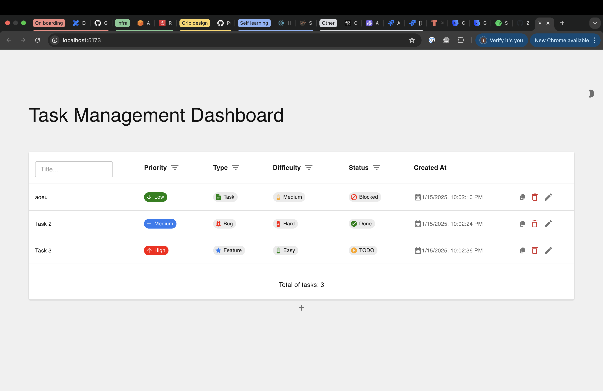
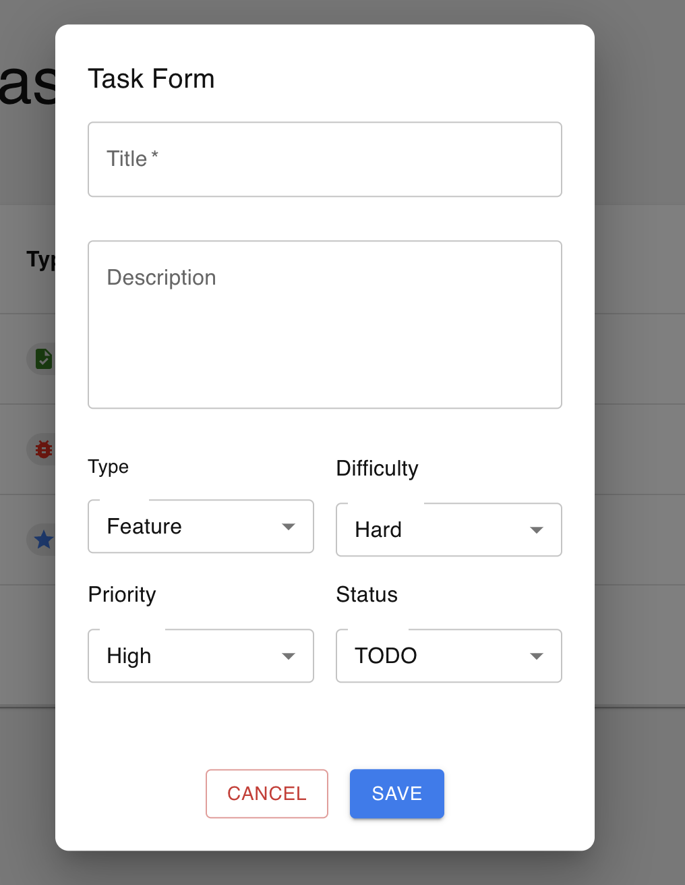
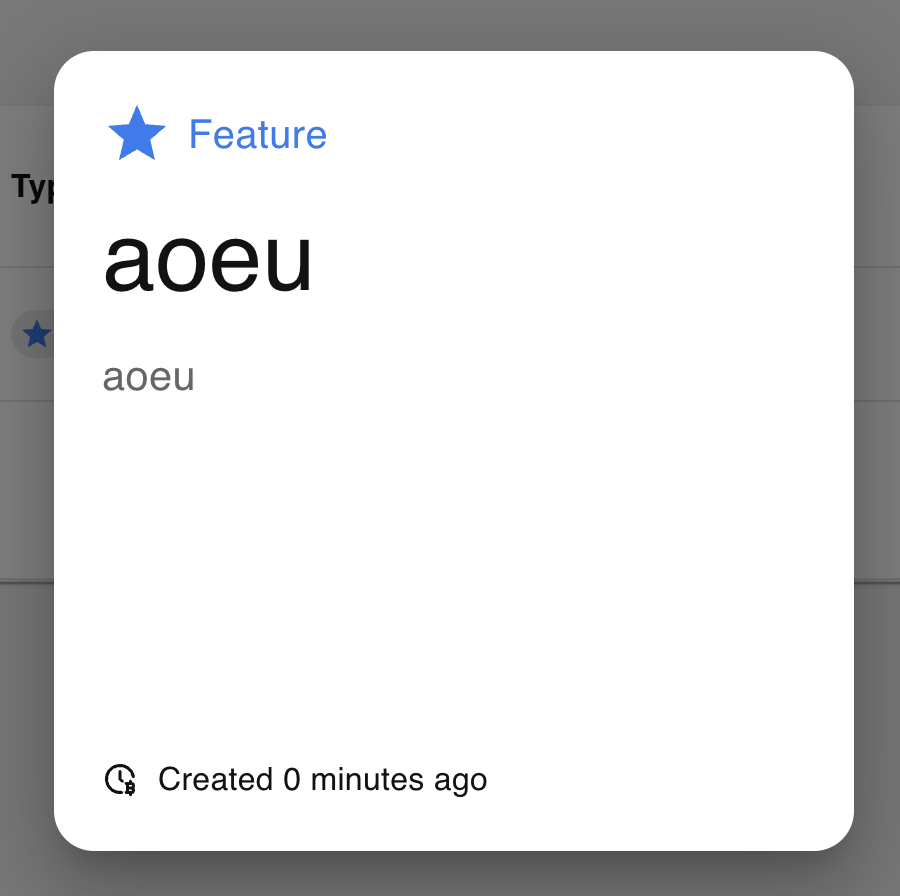

# Task Dashboard

## Run the project

- run `pnpm i` to install the dependencies

- run `pnpm run lint` to check the code

- run `pnpm run lint:fix` to fix the code

- run `pnpm run dev` to run the dev server

## Views

[View Dashboard](./src/pages/TasksDashboard.tsx)

[View Task form](./src/components/task/TaskForm.tsx)

[View Task view](./src/components/task/TaskView.tsx)

[Store Code](./src/store/useTaskStore.js)